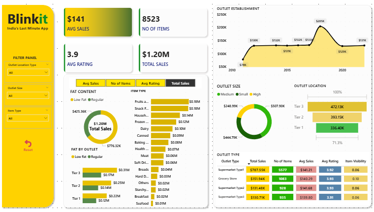

# Blinkit_PowerBI_Dashboard
##  Project Overview
This project is an interactive **Power BI dashboard** built to analyze Blinkit grocery sales data.  
The dashboard provides insights into sales performance, outlet distribution, product categories, and customer ratings to support data-driven decision making.

---

## Dashboard Highlights
- Total Sales, Average Sales, Number of Items, and Average Rating KPIs
- Sales trend analysis by Outlet Establishment Year
- Sales breakdown by:
  - Outlet Size
  - Outlet Location
  - Outlet Type
  - Item Type
  - Fat Content
- Interactive slicers for filtering data
- Reset Filters button implemented using bookmarks
- Clean and business-friendly dashboard design

---

##  Tools & Technologies Used
- **Power BI Desktop**
- **Power Query** (Data Cleaning & Transformation)
- **DAX** (Measures & Calculations)

---

##  Key DAX Measures
- Total Sales
- Average Sales
- Number of Items
- Average Rating
---
##  Features Implemented
- Interactive slicers for dynamic analysis
- Bookmark-based Reset Filters functionality
- Custom KPI cards and charts
- Optimized canvas size for full-screen viewing
- User-friendly layout and color theme

---

##  Key Learnings
- Data cleaning and transformation using Power Query
- Creating business KPIs using DAX
- Designing interactive dashboards in Power BI
- Using bookmarks for enhanced user experience
- Understanding canvas sizing and dashboard layout best practices

---

##  Dashboard Preview

